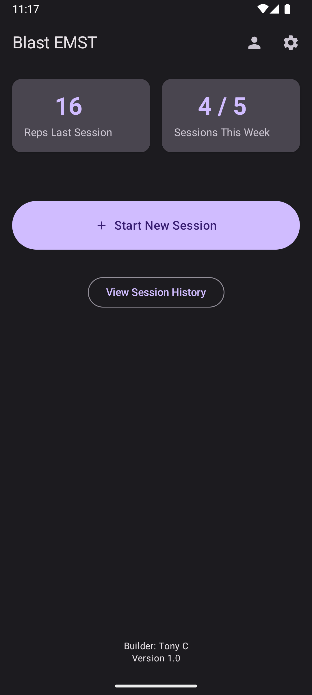
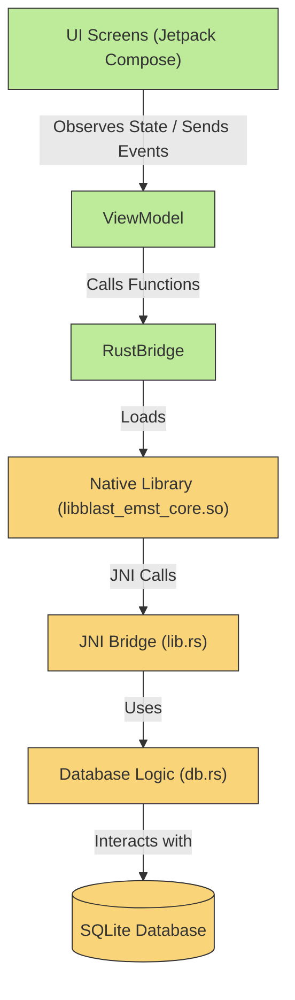

# Blast EMST - Expiratory Muscle Strength Training App

Blast EMST is a mobile application for Android designed to help users track their Expiratory Muscle Strength Training (EMST). It features an engaging dashboard, an interactive session history, and smart, goal-oriented reminders.

## Core Features

- **Engaging Dashboard Home Screen:** A modern, clean UI that provides at-a-glance statistics for the reps in the last completed session and progress towards the user's weekly session goal.
- **Interactive Calendar History:** A visual, calendar-based view of your session history. Days with completed sessions are marked, and tapping on a day reveals a detailed list of the sessions completed on that date.
- **Session Management:** Start, track, and end training sessions with detailed notes.
- **Haptic & Audio Feedback:** Provides customizable sound and vibration feedback for each repetition.
- **Smart Goal-Oriented Reminders:** An intelligent notification system that reminds users to train only if they are falling behind on their weekly session goal. The reminder is triggered by 24 hours of inactivity.
- **Customizable Settings:** A comprehensive settings screen to control training parameters, app theme, and feedback options.

## Architecture

This project features a hybrid architecture that leverages the strengths of both Rust and Kotlin. The core business logic and database management are handled by a high-performance **Rust** library, which is called from a modern, reactive Android frontend built with **Kotlin** and **Jetpack Compose**.

## Building the Project

The project is divided into two main parts: the Rust core and the Android app.

### 1. Build the Rust Core

The Rust core must be compiled first. The repository includes a helper script to build the Rust code for all required Android architectures.

1.  Navigate to the `blast_emst_core` directory: `cd blast_emst_core`
2.  Ensure the build script is executable: `chmod +x build_android.sh`
3.  Run the script: `./build_android.sh`

This script compiles the native libraries (`.so` files) and automatically places them in the correct `app/src/main/jniLibs` directory.

### 2. Build the Android App

Once the Rust libraries have been built:

1.  Open the entire project's root `BlastEMST` folder in the latest version of Android Studio.
2.  Allow Gradle to sync the project dependencies.
3.  Use the standard **Build > Make Project** or click the "Run" button to build and deploy the app.

## License

This project is licensed under the MIT License. See the `LICENSE` file for details.